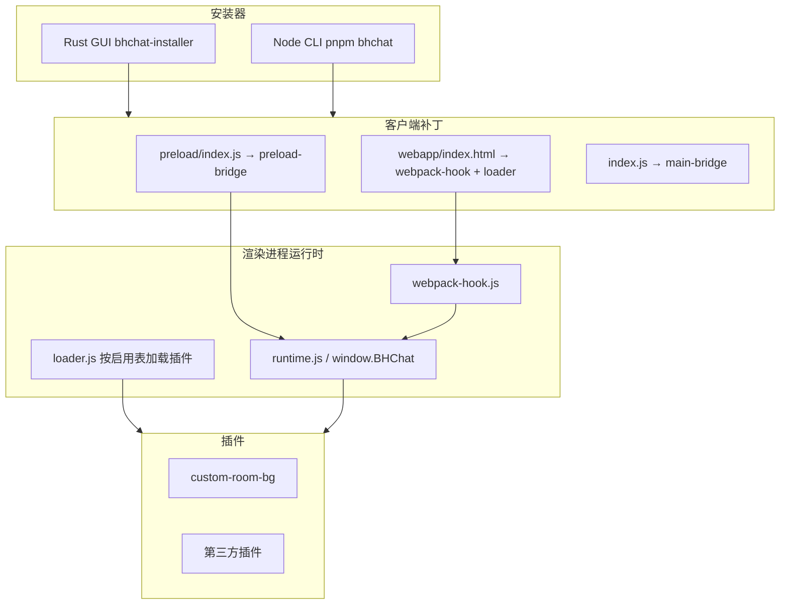

# 架构

插件作者先看 [08-plugin-api.md](./08-plugin-api.md) 和 [09-plugin-dev.md](./09-plugin-dev.md)。官方 preload 的细表在本机 `internal-docs/`（不入库）。

## 目标架构



## 组件职责

### 1. Loader / 安装器

- 检测安装路径与版本（注册表 / `%LOCALAPPDATA%\Qingfeng\HeyboxChat` / Program Files）
- Patch：
  - `source/preload/index.js` — 末尾 `require` `betterheyboxchat/preload-bridge.js`
  - `webapp/index.html` — 先注入 `webpack-hook.js`，再注入 `loader.js`
  - `index.js` — 文件头 `require('./betterheyboxchat/main-bridge.js')`（只挂 app 事件，不替换 `BrowserWindow`）
- 将仓库 `runtime/` 复制到客户端 `betterheyboxchat/`
- 卸载时从 `.backup/` 还原
- GUI 在操作前后可关闭 / 重启 `HeyboxChat.exe`

源文件只改仓库根目录 `runtime/`。`pnpm build` 复制到 `packages/loader/runtime/`。Debug 安装器直接读 `installer/../runtime/`。

### 2. 插件运行时（Renderer）

| 文件 | 职责 |
| --- | --- |
| `webpack-hook.js` | hook `webpackChunkheybox_chat.push`；注入设置侧栏；已安装插件列表按 `panel.id === plugin.id` 挂「设置」，钻取渲染对应 panel |
| `runtime.js` | 稳定 `window.BHChat`（Vue/Vuex、事件、存储、启停、重启） |
| `loader.js` | 读 `bhchat.plugins.enabled`，跳过禁用插件，再 `_ready()` |
| `lib/storage.js` | `electronAPI` 优先，回退 `localStorage` |
| `main-bridge.js` | F12 / Ctrl+Shift+I；禁止 Proxy 替换 `BrowserWindow` |
| `preload-bridge.js` | DevTools 开关；**禁止**改 `ELECTRON_ENV` |

模块 ID（仅 1.56.0）对插件隐藏，只在 hook 内部使用：`42416` 设置菜单、`93509` UserConfig、`30570` EventBus、`16886` Vuex。

### 3. Preload Bridge

- 现用于 DevTools 标记文件 `devtools.disabled` 与 IPC
- 不重复封装已有 `electronAPI`；插件优先走 `BHChat.electron` / `BHChat.storage`

### 4. 插件包格式

```
runtime/plugins/
  my-plugin/
    manifest.json
    index.js
    style.css        # 可选
```

`runtime/plugins.json` 是加载清单（安装时随 runtime 部署）。字段与各插件 `manifest.json` 对齐：

```json
{
  "id": "custom-room-bg",
  "name": "自定义房间背景",
  "version": "1.0.0",
  "author": "AwCat",
  "repository": "https://github.com/BetterSomething/BetterHeyboxChat",
  "desc": "为当前房间设置仅自己可见的自定义背景图。",
  "minClientVersion": "1.56.0",
  "enabled": true,
  "entry": "index.js"
}
```

用户开关写入本地存储 `bhchat.plugins.enabled`，覆盖 manifest 默认值。禁用的插件**不加载脚本**，设置页仍列出以便重新打开。开关**重启后生效**；设置页有「立即重启客户端」按钮（`BHChat.restart()` → `electronAPI.restartApp`）。

用户安装的插件不写入 `runtime/plugins/`，而在 `{dataRoot}/plugins/<id>/`。`dataRoot` 默认 `%APPDATA%\BetterHeyboxChat`，可用安装器「修改数据地址」更改。loader 合并 `plugins.json` 与用户目录扫描结果；内置 id 禁止覆盖。

## BHChat API（稳定面摘要）

完整签名见 [08-plugin-api.md](./08-plugin-api.md)。

```javascript
window.BHChat = {
  version, clientVersion,
  onReady, getVue, getStore, mapState, watch,
  on, off, emit,
  injectCSS, injectStyleUrl,
  registerPanel, listPanels,
  registerPlugin, getPlugin, listPlugins, isPluginEnabled, setPluginEnabled,
  restart, storage, storage.ns(pluginId),
  electron, overlay, steam, laughter, devtools, openSettings,
}
```

插件**不要**直接使用 `__bhchat_require__` 或模块 ID。

## Webpack Hook（已实现要点）

- 必须在 webpack 主包之前同步加载；主包会覆盖 `push`，因此定时 re-hook
- 禁止在工厂未就绪时 `__webpack_require__(93509)`（会污染缓存，设置弹窗永久打不开）
- 设置组件必须用 `render(h)`：官方 Vue 是 runtime-only
- 插件设置通过 `registerPanel({ id, title, component })` 挂载（`id` 须等于插件 id）；设置页从已安装插件列表钻取打开，不要改 hook 源码

## 阶段状态

| 阶段 | 状态 |
| --- | --- |
| Phase 1 Loader（CLI + GUI、可还原、MVP 房间背景） | 已完成 |
| Phase 2 BHChat API、Vuex watch、插件启停、开发文档 | 已完成 |
| Phase 2 热更新后 patch 完整性校验 | 已落地（main-bridge `ensurePatches` + `BHChat.onClientUpdate`） |
| Phase 3 在线货架（独立插件仓 `registry.json`） | 已落地（只拉清单，按需下载；市场可改读本地仓） |
| Phase 3 社区模板、多版本映射 | 未开始 |

## 关键 Patch 点（1.56.0）

| 文件 | 路径（相对 app 根） | 操作 |
|------|---------------------|------|
| Preload | `source/preload/index.js` | 末尾 require bridge |
| 主界面 HTML | `webapp/index.html` | 双 script：hook 然后 loader |
| 主进程入口 | `index.js` | 头部 require main-bridge |
| 运行时 | `betterheyboxchat/` | 复制 `runtime/` |

热更新可能覆盖 `webapp`。`main-bridge` 在窗口加载前跑 `ensurePatches`，缺标记就补回 html / preload / index.js。内置插件 `block-update` 可拦截 `update-client`（完整更新）和 `updateAsarResource` / `setAsarVersion`（热更新）。

## 调试

- 安装后默认启用原生 DevTools：`F12` / `Ctrl+Shift+I`
- 无需 DevTools：右下角 **BHC vx.x.x** 角标 + 设置侧栏 BetterHeyboxChat（「显示角标」可关）
- 改 `runtime/` 后用 **Debug 安装器重装**即可，不必 `cargo build`
